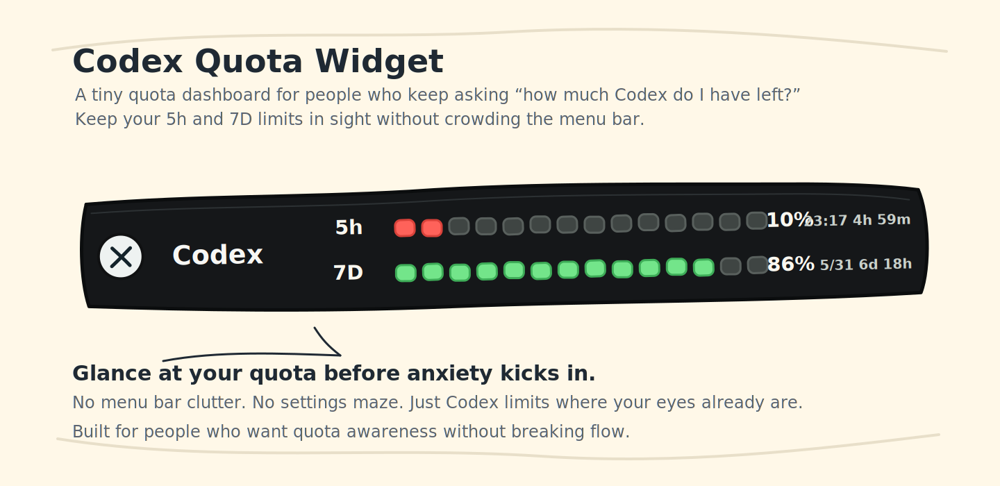
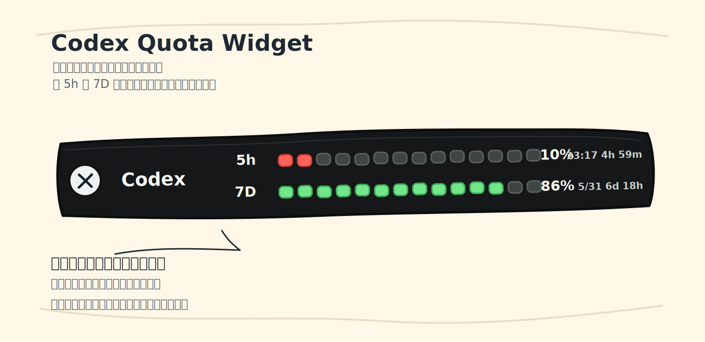

# Codex Quota Widget

> A tiny macOS helper that keeps your Codex quota visible before quota anxiety kicks in.  
> 主功能是桌面悬浮胶囊；Touch Bar 是给老款 MacBook Pro 用户的增强显示。


Optional Touch Bar preview:



Chinese UI preview:



## What It Does

Codex Quota Widget shows your Codex 5-hour quota and weekly quota in a floating desktop capsule. If your Mac has a Touch Bar, it can also mirror the same quota as a segmented bar.

- Main display: a floating desktop capsule that stays visible while Codex is running.
- Optional display: a Touch Bar view with segmented quota bars, remaining percentages, reset times, and countdowns.

It is built for people who use Codex heavily and want the same kind of ambient awareness as a download speed widget or battery meter: glance once, keep working.

## 它解决什么问题

Codex 的剩余额度通常藏得比较深，需要点进本地模式里的额度状态才能看到。这个小工具的主功能是桌面悬浮胶囊，所以没有 Touch Bar 的 Mac 也能正常使用：

- 桌面悬浮胶囊：一直在屏幕边缘显示，不占菜单栏。
- Touch Bar 展示条：如果你的 Mac 有 Touch Bar，可以像电量条一样显示 `5h` 和 `7D`。
- 只在 Codex 运行时出现，Codex 退出后自动隐藏。
- 双击或右键菜单可以立即刷新数据。

## Highlights

- Native macOS helper written in `Swift + AppKit`.
- No menu bar clutter, no Dock icon, no Python GUI dependencies.
- Reads quota from Codex's local `app-server` first, then falls back to session logs.
- Shows the real `codex` quota bucket and avoids the misleading `codex_bengalfox` bucket.
- Optional Touch Bar display for Touch Bar MacBook Pro models.
- Touch Bar copy can switch between English and Chinese from the capsule context menu.
- LaunchAgent support for silent login startup.

## 功能亮点

- 原生 `Swift + AppKit` 实现。
- 不占菜单栏，没有 Dock 图标。
- 优先通过 Codex 本机 `app-server` 读取真实额度，日志解析只作为备用。
- 只读取 `rateLimitsByLimitId.codex`，避免误读其他额度桶。
- Touch Bar 是可选增强，适合仍在使用 Touch Bar MacBook Pro 的用户。
- 右键胶囊可以在 English / 中文 Touch Bar 文案之间切换。
- 支持登录后后台自启，打开 Codex 后自动出现。

## Install

Clone the repo, then run:

```bash
./scripts/install_launch_agent.sh
```

This will:

- Build the native helper.
- Copy the binary to `~/.codex-quota-widget/bin`.
- Install a user-level LaunchAgent.
- Start the helper immediately.

To restart after making changes:

```bash
./scripts/restart_helper.sh
```

To uninstall:

```bash
./scripts/uninstall_launch_agent.sh
```

## 安装使用

进入项目目录后运行：

```bash
./scripts/install_launch_agent.sh
```

安装完成后：

- 登录 macOS 后 helper 会静默启动。
- 没打开 Codex 时不会显示任何东西。
- 打开 Codex 后，桌面胶囊和 Touch Bar 会自动出现。
- 关闭 Codex 后，它们会自动隐藏。

如果 Touch Bar 被系统关闭按钮隐藏，可以右键桌面胶囊，选择 `显示 Touch Bar` 重新显示。

如果想切换 Touch Bar 文案语言，可以右键胶囊，选择 `Language: English` 或 `Language: 中文`。

没有 Touch Bar 的 Mac 会继续使用桌面悬浮胶囊，不需要二次开发。

## Manual Run

For local testing:

```bash
./scripts/run_local.sh
```

To verify the quota data source:

```bash
./scripts/build.sh
./bin/CodexQuotaWidget --once
```

If the output contains `"sourceFileName": "Codex app-server"`, the primary data source is working.

## 手动验证

本地调试可以运行：

```bash
./scripts/run_local.sh
```

检查数据源：

```bash
./scripts/build.sh
./bin/CodexQuotaWidget --once
```

如果输出里看到 `"sourceFileName": "Codex app-server"`，说明已经通过 Codex 本机服务拿到了真实额度。

## Notes

- Touch Bar display uses macOS private Touch Bar APIs. If your Mac does not have Touch Bar, or the API is unavailable, the floating capsule still works.
- This is an unofficial personal tool and is not affiliated with OpenAI.
- The Codex internal app-server protocol may change in future releases.
- Released under the MIT License.

## 注意事项

- Touch Bar 展示使用了 macOS 私有 Touch Bar API；没有 Touch Bar 的 Mac 或系统不支持时，桌面胶囊仍然可用。
- 这是一个非官方个人工具，不代表 OpenAI。
- Codex 本机 `app-server` 的内部协议未来可能变化。
- 项目使用 MIT License 开源。

## Credits

The Touch Bar quota display idea is inspired by 小红书 creator **@Fly**，小红书 ID：`26872565825`.  
This project adapts that idea into a local floating capsule plus Touch Bar helper.

## 致谢

Touch Bar 额度条的创意来自小红书作者 **@Fly**，小红书 ID：`26872565825`。  
这个项目是在原有桌面胶囊小工具基础上的本地化改造与实现。
